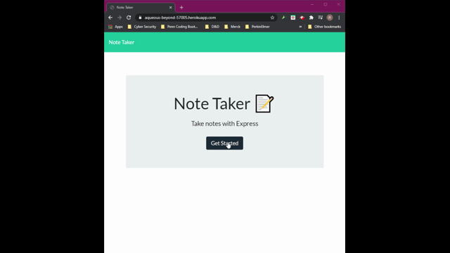

# Note Taker App

### Description
_____________________________
This application can be used to wrte and save notes.  This app utilizes Express.js backend and will save and retrieve note data from a JSON file.

### Table of Contents
_____________________________
* [Installation](#installation)
* [Usage](#usage)
* [Questions](#questions)

### Installation
_____________________________
*Steps required to intall and run this program:*

There are no special requirements for installation to run this program.

Click on the [link](https://aqueous-beyond-57005.herokuapp.com/.) here!

### Usage
_____________________________
*Instructions and example for use:*

### Questions
_____________________________

  Please click on the link provided to access the author's [Github](http://github.com/RaeStichter).
  